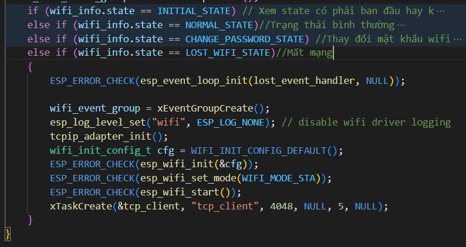

# Giới thiệu chung
Dự án này được viết nhằm mục đích tạo thiết bị đo  khí Gas,cường độ ánh sáng và nhiệt độ và được điều khiển và thu thập bởi gateway

Dự án này dùng ESP32.      
  
  ---

# Yêu cầu hệ thống

1. Phiên bản ESP-IDF từ 3.5 trở lên

---

# Partitions Table Config
Cần phân vùng cho SPIFFS sử dụng để lưu trữ các trạng thái led, mode led, và các thông tin của wifi

---

#  Network Config
Ban đầu ESP32 sẽ chạy ở chế độ AP để người dùng có thể config SSID và password cho ESP32. Người dùng cần gửi request đến địa chỉ [192.168.4.1/hello](192.168.4.1/hello) để có thể sử dụng web local.

---

# Hướng dẫn sử dụng code

### Khởi tạo ngoại vi 
- Khởi tạo các chân của ngoại vi
- Khởi tạo Timer và đăng ký callback cho Led 7Segment
- Cấu hình độ phân giải của ADC
- Chọn range 3.3V cho ADC

---

### Khôi phục thông tin Wifi 
- Khởi tạo bộ nhớ NVS
- Lấy thông tin được lưu trước đó từ NVS
- Đọc trạng thái led được lưu vào nvs để tiếp tục bật/tắt

---

### Các trạng thái của Wifi 
- Trạng thái INITIAL_STATE là trạng thái khi mới sử dụng thiết bị, người dùng phải cung cấp SSID và Password.
- Trạng thái NORMAL_STATE là trạng thái wifi đã được cấu hình và chạy ở chế độ Station
- Trạng thái LOST_WIFI_STATE là trạng thái ESP32 không thể kết nối đến router, nó sẽ kết nối với gateway thông qua TCP/IP để người dùng có thể điều khiển local.
- Trạng thái CHANGE_PASSWORD_STATE là trạng thái ESP32 sẽ dùng SSID và Password mới mà người dùng cung cấp.

---

### Cảm biến nhiệt độ DS18B20 
- Khởi tạo chân Data là PIN14
- Gửi tín hiệu Start đến cảm biến và đợi phản hồi
- DS18B20_Write gửi command đến DS18B20 bằng cách kéo chân data xuống mức thấp 1 khoảng thời gian tuỳ theo bit đó cao hay thấp
- Read Scratch-pad từ DS18B20 bằng cách kéo chân data xuống low 2us và đặt chân data làm input.Lúc này DS18B20 sẽ trả về dữ liệu 16Bit về nhiệt độ.

---

### Task Periperal
- Task này có nhiệm vụ đọc dữ liệu từ DS18B20, Cảm biến khí Gas MQ-02 và quang trở
- Gửi các command như theo datasheet của DSB1820 rồi đọc dữ liệu 16bit
- Giá trị ADC cho quang trở và cảm biến khí gas sẽ được đọc 64 lần và chia trung bình 
- Giá trị cảm biến khí Gas sẽ kích hoạt còi báo nếu phát hiện khí Gas
- Tuỳ theo cường độ ánh sáng và chế độ cài đặt của người dùng, đèn sẽ sáng theo cường độ ánh sáng.
- Dữ liệu về ngoại vi sẽ được đóng gói JSON để truyền đến Gateway.

---

### Điều khiển Led
- Led được điều khiển bởi nút bấm hoặc trên Browser
- Một interrupt được sinh ra nếu người dùng bấm nút 
để bật tắt led, và lưu lại trạng thái led vào nvs.

---

### Hiển thị nhiệt độ bằng Led 7 Segmeet
- Hàm Timer_CallBack sẽ được gọi lại mỗi 2ms từ bộ đếm Timer của ESP32
- Các led 7 segment được bật mỗi 2ms để hiển thị nhiệt độ
- Độ chính xác là 0.1%

---

### Xử lý dữ liệu nhận được từ Gateway
- Task sẽ chuyển từ BLOCKED sang RUNNING nếu Device nhận được dữ liệu từ gateway
- Dữ liệu nhận được có thể là bật tắt led, cài đặt mode led

---

### Nhận dữ liệu Local bằng TCP Client 
- ESP32 sẽ kết nối đến TCP Server(___Gateway___) dựa theo IP và Port (3000)
- Domain type là IPv4
- Task này có nhiệm vụ kết nối đến Gateway và gửi dữ liệu đồng thời nhận điều khiển từ gateway.

